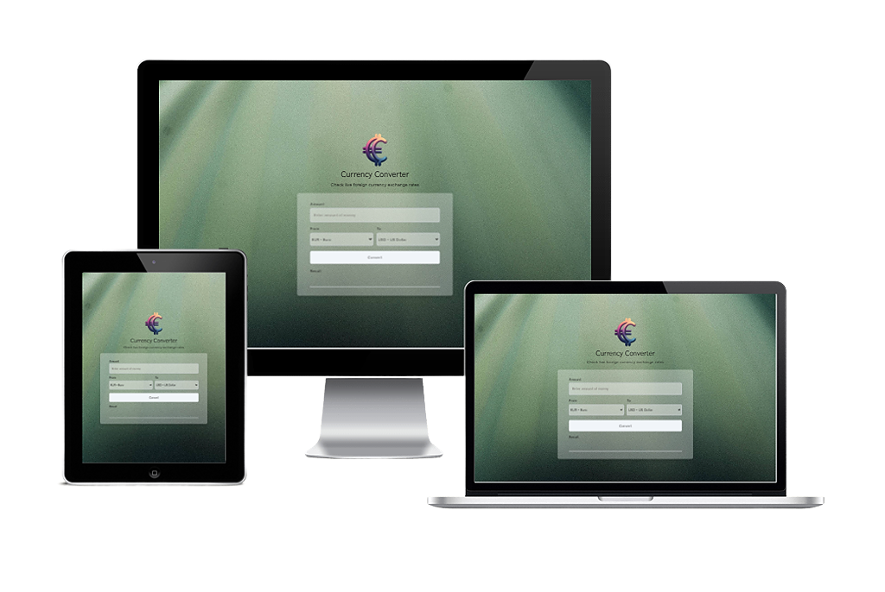

# Currency Converter

  
[**Screenshots**](#screenshots) || [**Features**](#features) || [**Technologies**](#technologies) || [**Color Reference**](#color-reference) || [**What I learned**](#what-i-learned) || [**Demo**](#demo) || [**Author**](#author)

This repository contains all the code for a currency converter application. The application is developed using Tailwind CSS and JavaScript.

The application is a web application that allows users to convert between different currencies. Users can select the currencies they want to convert, enter the amount, and then perform the conversion.

The [Coinbase API](https://api.coinbase.com/v2/prices/EUR-TRY/spot) is used to fetch the current exchange rates.

## Screenshots

## Features

- Aesthetic appearance with a background image.
- Simple and user-friendly interface.
- Conversion form:
	- Ability to select the currencies to convert.
	- An input field to enter the amount to convert.
	- Conversion button.
- Conversion functionality:
  - Performs the conversion using the Coinbase API.
- Displaying the result:
  - Shows the converted amount to the user.

## Technologies

- Tailwind CSS
- JavaScript
- HTML
- Coinbase API

## Color Reference

| Color             | HEX         |
| ---------------- | --------------- |
| Cod Gray         |  #0a0a0a |
| Mischka         |  #d1d5db |
| Athens Gray      |  #e5e7eb |
| Catskill White         |  #f1f5f9 |

## What I learned

- Enhanced my skills in front-end development using Tailwind CSS.
- Deepened my understanding of asynchronous JavaScript and API integration.
- Learned how to fetch and process data from external APIs.
- Improved my knowledge of HTML structure and form handling.

  
## Demo

[https://currency-converter-sigma-pink.vercel.app/](https://currency-converter-sigma-pink.vercel.app/)

  
## Author

- E-mail - [mkambur@proton.me](mkambur@proton.me)
- LinkedIn - [@mkambur](https://linkedin.com/in/mkambur)